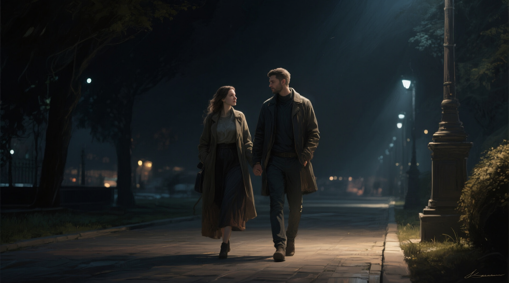

# qwen_image_play 
Create still images using Huggingface diffusers library and latest Qwen Image model



"A couple strolling in a dimly lit dark night, digital painting, artstation, concept art, Sergey Kolesov , Breathtaking, 8k resolution, extremely detailed, beautiful, establishing shot, artistic, hyperrealistic, octane render, cinematic lighting, dramatic lighting, masterpiece, light brazen, extremely detailed and beautiful face"

## Hardware Configuration 
* Intel/AMD system with at least 24 cores
* 256 GB DDR5
* NVIDIA 5090 w/ 32GB VRAM
* 80GB free storage space for models

## Prerequisites 

System setup with:
* kernel drivers for NVIDIA GPU
* docker with NVIDIA-Runtime support
* 'make' installed with your package manager (e.g. apt install make)
 
## Steps for setup and execution

1. Build docker container
```bash
$ make image
```

2. Run sample to generate three different images from prompts under scripts/prompts.txt 
```bash
$ make run
```
On NVIDIA 5090 card, it takes about 1 minute to generate each image.  They will be located as 0.png, 1.png, and 2.png in the root folder

# References
* https://prompthero.com
* https://huggingface.co/Qwen/Qwen-Image
* https://huggingface.co/DFloat11/Qwen-Image-DF11
